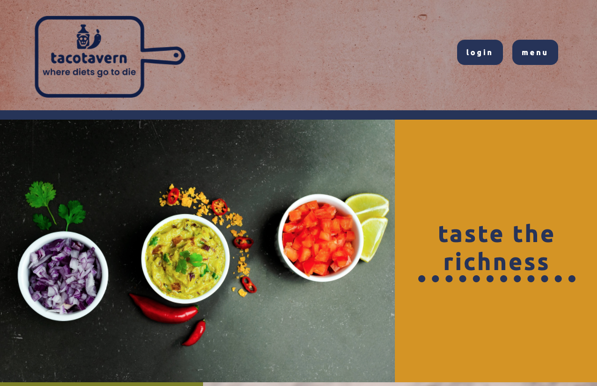

## 1st Party Business App

[Deployed](https://www.taco-tavern.com/)    |    [Repo](https://github.com/mliemann/1st-Party-Business-App)

## Description
Why wait at a restaurant when you can order ahead online? Pick from different restaurants and order your favorite dishes from them. Order conviently online and like your favorite dishes. Restaurant owners, add your restaurant so customers can order from you and view order stats through your profile. Contact us for more information.

## Table of Contents
[Installation](#installation)

[Usage](#usage)

[Technologies Used](#technologies)

[License](#license)

[Contact](#contact)

## Installation
No installation needed.

## Usage
Test card number: 4242 4242 4242 4242, enter any exp, CVV code and zipcode
For customers: use this site to order food from your favorite restaurants easily. Pay online using the Stripe API. Customers can also view how many likes different dishes have and like their own.
For restaurant owners: upload your business so customers can order from you online. From your dashboard you can see the number of likes each dish has.

## Technologies
Technologies used: React.js, JavaScript, MySQL, Express, Sequalize, HTML, CSS, Node.js, MySQL, AWS S3, Cloudinary, Rechart.js, Heroku, Cloudflare, Google Domains, Stripe, Bcrypt, Crypto

## License
License: Propietary License -- No Redistribution Allowed

## Contact
Contact: 
dauphineburns@gmail.com    |    mliemann@live.com    |    tdnc85@yahoo.com    |    drewml08@gmail.com
