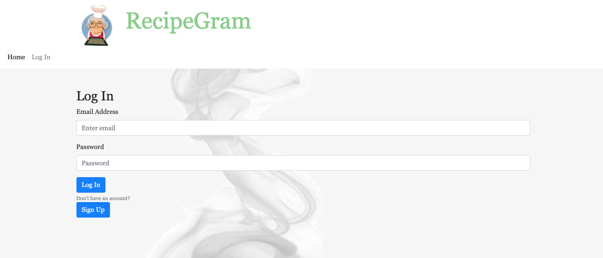
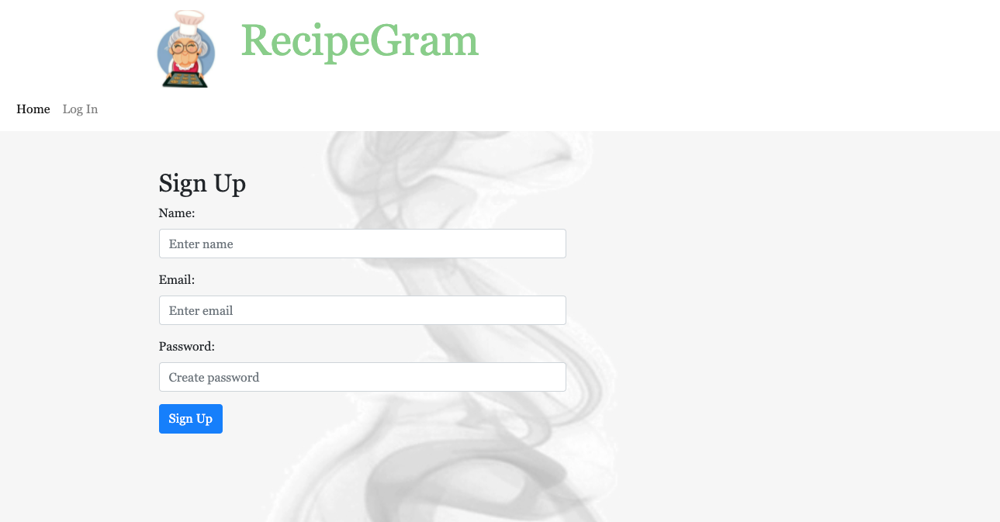
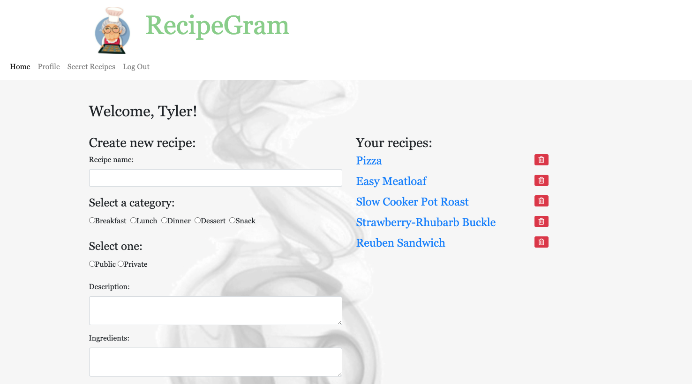
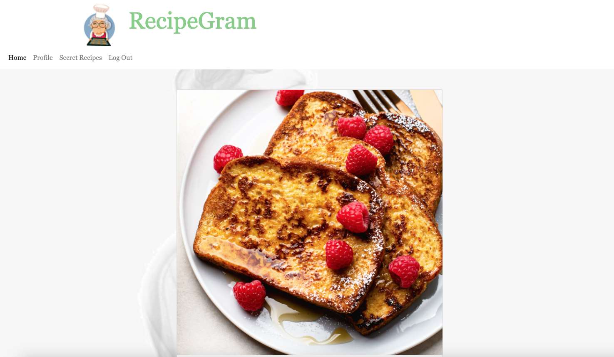
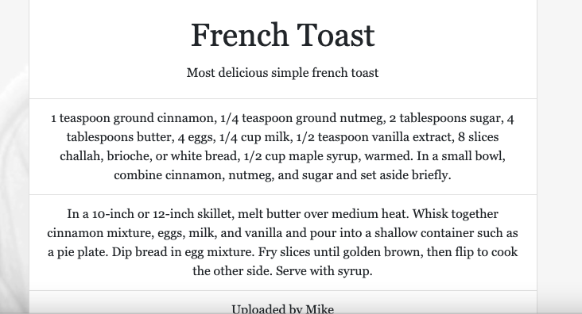

## 1st Party Business App

[Deployed]()    |    [Repo]()

## Description

## Table of Contents
[Installation](#installation)

[Usage](#usage)

[Technologies Used](#technologies)

[License](#license)

[Contact](#contact)

## Installation
No installation needed.

## Usage

## Technologies
Technologies used: JavaScript, SQL, Express, Sequalize, HTML, CSS, Node.js, MySQL, AWS S3

## License
License: None

## Contact
Contact: 
dauphineburns@gmail.com
mliemann@live.com
tdnc85@yahoo.com
drewml08@gmail.com
